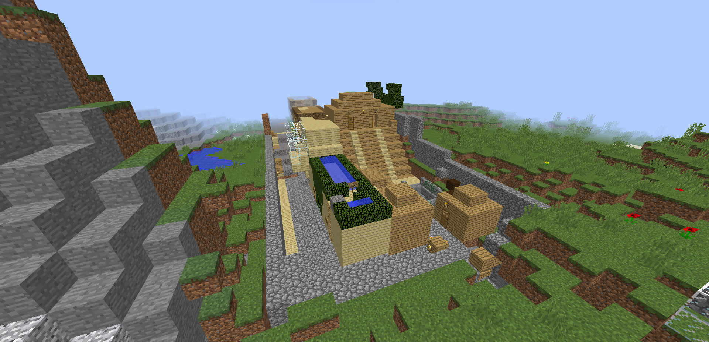
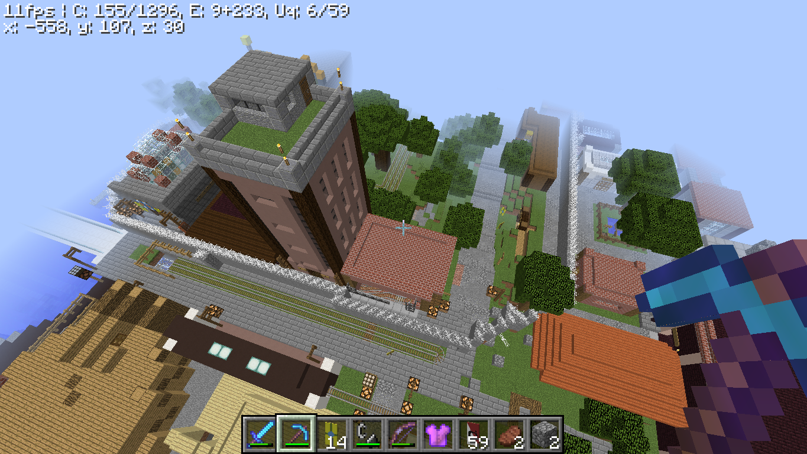
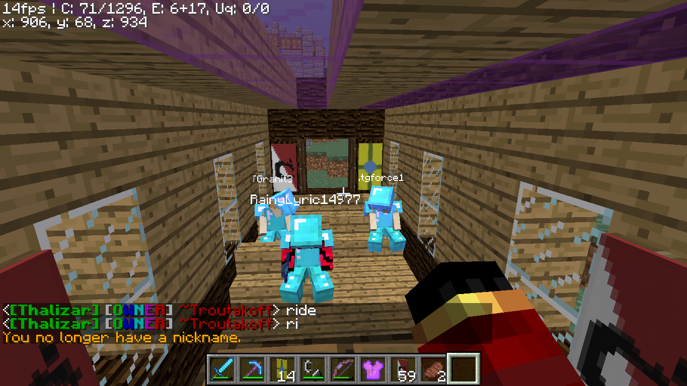

# The Thalizar Empire

### National Anthem



### Geography

The Empire Is located just north of spawn, to the east of Luxuria, and south of Laxamentum, North of The Red Skull Sultanate, and West of the now disbanded USSA. It is south of the Nordian Shogunate.

The Empire is divided into many provinces, among them, the Bosque in the eastern tundra forest, the Nordian Shogunate in the west part of Thalizar Mountain, Rana County in the south, and "Central Thalizar (Thalizar city territory)". Within these provinces, are even more cities.

Rana County:

'Central Thalizar': Thalizar City

Most housing in the nation is centered in Thalizar City, and Civitas (mainly its suburb Rextonville) . There is significant industry (manufacturing, paper mill, brewery) in the south bordering the river Thal.

### History

The Thalizar Empire is what remains of Stormton, the old empire from season 1 in December 2022 and January 2023.

According to an early video on the ADSCRAFTOLD youtube channel [(Click here to watch it)](https://www.youtube.com/watch?v=6AYoEcyRDBg)

'One player, Chicken, said "A world without Stormton would be like a toast without butter"'

<figure><figcaption></figcaption></figure>

Stormton was rewarded with peace and prosperity, but by season 5, It had almost disappeared due to a lack of new players. However, In Season 6, all the players and ideas that belonged to stormton were reborn, in the Thalizar Empire.

The Thalizar Empire, Created by QuizzityMC, who was the old king of Stormton, ADSBARCHER, with a new name, was a nation that quickly grew, as it was founded when there were barely any other countries in the world.

[File:The Past, Present and future of the Thalizar Empire.pdf](https://adscraft.fandom.com/wiki/File:The_Past,_Present_and_future_of_the_Thalizar_Empire.pdf)

The Thalizar Empire grew significantly during 2023 and 2024, mostly around Thalizar Harbour, forming "Thalizar City", which was the center of political activity and attention.

After the separation of [Luxuria](the-capitalist-state-of-luxuria.md) (Run by ErezDaBerez), a city-state based on the traditional Thalizanian town of Stormton, to the north-east of Thalizar City, from the main empire tried to expand north with the help of Nordian shogun HenryWauzivuff.&#x20;


Although not discussed in the narration, this war and all events are actually the war for Luxurian independence.&#x20;


However, Nordia soon also demanded independence, which it achieved. See [THIS](https://www.youtube.com/watch?v=F83s-eiDHeU\&t=203s) video for a significant discussion between the leaders of the two nations.

After the election of Tramountanas as Prime Minister (see below), RainyLyric14977 fled the empire and founded the "[Republic of Nova Glacier Bay](the-republic-of-nova-glacier-bay.md)", with the apparent aim of undermining the government of Thalizar.

However, Thalizar remained the main nation for new players, building, and prosperity, albeit without any semblance of a democratic system, for the continuation of the history of the server.

### Politics

The Thalizar Empire is currently in a trade alliance with Luxuria, and is backing Nordia's rise. However, this trade alliance has been strained by multiple acts of defense and aggression from both sides. By March, a war was to be expected. It has a prime minister, RainyLyric14977 and an Emperor, QuizzityMC. It is a constitutional Monarchy with a parliament located in the city of Civitas. It was an ally of the USSA until it disbanded itself, and gave the land to the prime minister at the time, tgforce14 to start his own province, which has been named the Bosque. Later, after tgforce14 lost the next election on the 16'th of March 2024, with it being won by RainyLyric14977, with tgforce14 also abandoning the Bosque. In early 2025, Tramountanas was elected prime minister (although there were severe doubts regarding the democratic nature of the election) and QuizzityMC suspended elections indefinitely, leaving Tramountanas (popularly known as "Trouty" as Prime Minister. This allowed him to institute significant building projects.

Nordia has become allied with Thalizar, RainyLyric14977 has renamed himself Lucifer and has become a person who kills lots of people, and Nordia is rising as a new power far away in the snowy areas, having moved its seat of power south away from Thalizar to Bergentia. Thalizar is still a forceful power who's Emperor, QuizzityMC, and Prime minister, Tramountanas, who are having an agenda of reform and prosperity.

The Seat of government has now moved itself firmly to Civitas (which has numerous different areas for housing, commerce, entertainment and military activity. Thalizar City is all but abandoned. 

[https://quizzitymc.github.io/The-Thalizar-Empire/](https://quizzitymc.github.io/The-Thalizar-Empire/) - The Thalizar Empire has a website (formerly at https://thalizar.info/. NOW LARGELY DISFUNTIONAL)

### Notable Historical Events

<figure><figcaption>
7 July 2024 - Erection of the "Berlin Wall" in Thalizar City.
</figcaption></figure>

Built by RainyLyric and .tgforce14 (Gray) as an early attempt to get sovereign land for Nova. Very short lived and soon demolished, a small section of the wall remains for historical reasons.

<figure><figcaption>
Rainy and Gray were tried to building the wall.
</figcaption></figure>

(Below) The "Rise or Demise" video was based on a major war between Nova and an alliance of Thalizar and Nordia, in November 2024. HenryWauzivuff, Nordian shogun, betrayed the Alliance, leading to the destruction of a large part of Nordian heartland, the repositioning of Nordia away from the center of the server, and the faliure to resolve the conflict between Thalizar and Nova in any meaningful way.



