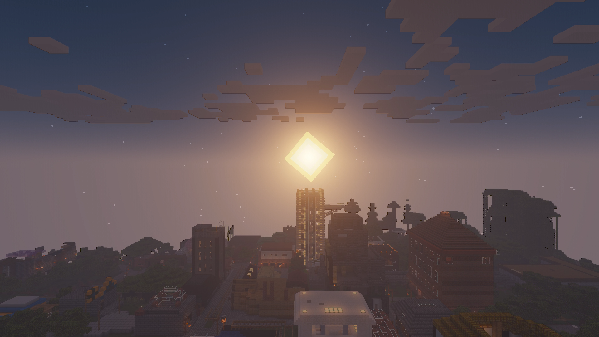

# Season 11

Season 11 has started as season X finished, there has not been a new world and the focus is still definitively on the Civilisations aspect, with mostly the same three nations dominating the scene, Thalizar, Luxuria and Nordia, however Nova has also become a key player, and major illegal nations have sprung up around the infamous RainyLyric14977.

It ended in end-march 2025, with the end of ADSCRAFT.

If you're looking for what happened from Season 9 - 11, look in detail at the countries pages. These have plenty of detail on the events.

<figure><figcaption>
Civitas, Thalizar. The last image taken on ADSCRAFT.
</figcaption></figure>
